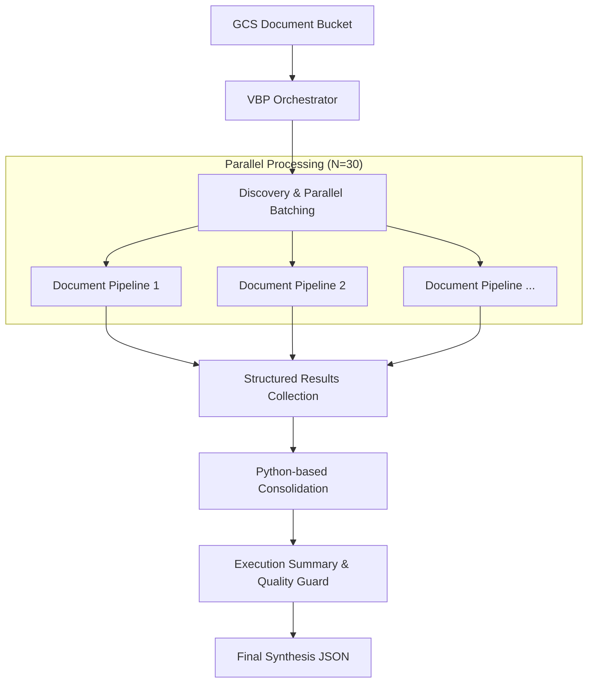
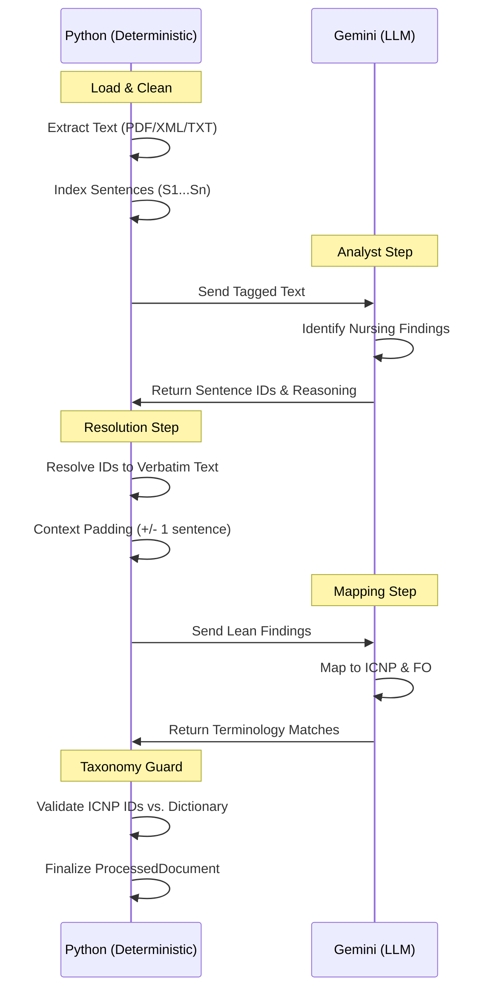

# VBP Workflow Architecture (ADK 2.0)

## 1. Goal
The VBP (Veiledende Behandlingsplan) Workflow is designed to process large volumes of clinical documents and synthesize them into structured, evidence-based treatment plans. The system prioritizes **clinical data integrity**, **traceability**, and **transparency** to build trust with medical professionals.

---

## 2. Pillars of Clinical Trust

To move beyond "black box" AI, the VBP architecture is built on three foundational pillars:

### 2.1 100% Verbatim Evidence (Anti-Hallucination)
The system employs a **"Read & Point" (Sentence Indexing)** architecture. Instead of generating verbatim text, the LLM identifies specific sentence identifiers (e.g., `["S12", "S15"]`) from a pre-indexed version of the document. The final clinical report uses Python logic to resolve these IDs back into the exact original text, ensuring that every quote is 100% verbatim and free from LLM rephrasing or hallucinations.

### 2.2 Strict Taxonomy Enforcement
All extracted findings (Nursing Diagnoses, Interventions, and Goals) are mapped to the official Norwegian **ICNP (International Classification for Nursing Practice)** terminology. 
- Functional Areas (FO) are strictly enforced via Pydantic Enums (1-12).
- ICNP Concept IDs are validated against a master dictionary in Python.
- Any finding that cannot be grounded in the official taxonomy or lacks valid evidence is excluded from the final report.

### 2.3 Comprehensive Traceability
Every run produces an **ExecutionSummary** that tracks exactly how many documents were processed, excluded, or encountered errors. Furthermore, every finding includes a `reasoning_trace`—a step-by-step clinical justification for why the document was selected and how the finding was derived.

---

## 3. High-Level Workflow

The workflow is managed by a root **VBP Orchestrator** that handles massive data parallelism and state consolidation.

---

## 4. The Document Processing Pipeline

Each document undergoes a rigorous, multi-stage transformation that balances LLM intelligence with deterministic Python safety checks.

---

## 5. Technical Stack
- **Framework**: ADK 2.0 (Agent Development Kit)
- **Model**: Gemini 3.1 Pro (Mapping) and Gemini 3.0 Flash (Extraction & Validation)
- **Orchestration**: Asynchronous Data Parallelism (`asyncio.gather`)
- **Safety**: PyMuPDF (PDF Parsing), BeautifulSoup (XML Cleaning), NLTK (Sentence Tokenization)
