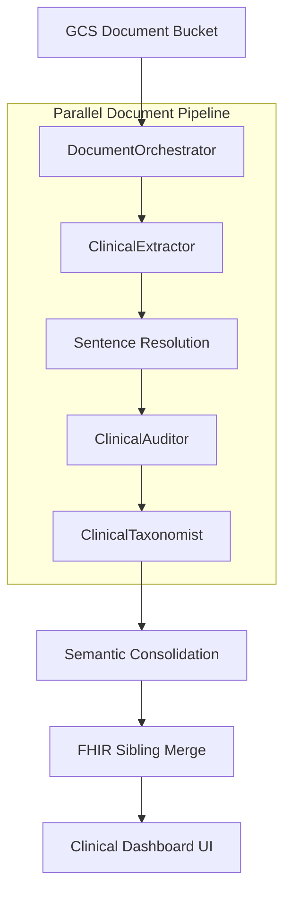

# VBP Workflow: Design Specification (ADK 2.0)

## Objective
The VBP (Veiledende Behandlingsplan) Workflow is an automated clinical synthesis engine designed to process large volumes of nursing literature and generate condensed, evidence-based treatment plans. It prioritizes **Verbatim Evidence**, **Taxonomy Adherence**, and **Deduplicated Consensus**.

---

## 🏗 High-Level Architecture

The workflow follows a 4-stage pipeline orchestrated by the `DocumentOrchestrator`:

1. **Extraction (ClinicalExtractor)**: Reads documents and extracts structured Diagnosis-Intervention-Goal triplets with Sentence IDs.
2. **Quality Audit (ClinicalAuditor)**: Evaluates extracted triplets for Specificity, Actionability, and Cohesion.
3. **Taxonomy (ClinicalTaxonomist)**: Maps findings to ICNP and VIPS Functional Areas.
4. **Consolidation (Python)**: Merges related findings, calculates TrustScores, and generates the Dashboard.

---

## 🛡 Pillars of Clinical Trust

### 1. Zero-Hallucination Evidence
We use a **"Read & Point"** architecture.
- The LLM never writes the quote text itself.
- It only provides **Sentence IDs** (e.g., `[S12]`).
- Python code deterministically resolves these IDs to exact text with a +/- 1 sentence context window.

### 2. Multi-Dimensional Quality Shield
Every finding must pass through the `ClinicalAuditor` agent, which assigns three metrics (1-10):
- **Specificity**: Is this specialized or generic nursing care?
- **Actionability**: Is the instruction precise and measurable?
- **Cohesion**: Does the Intervention logically treat the Diagnosis?
- *Rule*: Findings with a weighted score below **5.0** are automatically dropped.

### 3. Verification of GRADE Evidence
The system extracts explicit **Recommendation Strengths** and **Evidence Grades** if present.
- The LLM MUST provide a **Grade Sentence ID** to prove the claim.
- If the ID is invalid, the grade is stripped to prevent over-claiming clinical certainty.

---

## 🔍 The ClinicalTaxonomist (Quad-Agent Architecture)

To solve context saturation and improve mapping accuracy, the `ClinicalTaxonomist` is a specialized sequential orchestrator:

1. **Step 1: FO Classification**: Assigns the VIPS Functional Area (1-12) using the finding and reasoning trace.
2. **Step 2: Specialized Mapping**: Three sub-agents (`diag_taxonomist`, `int_taxonomist`, `goal_taxonomist`) map the raw text to standard ICNP concepts using the assigned FO as a semantic guardrail.

---

## 📊 Semantic Consolidation & Presentation

### 1. Sibling Merging (FHIR Subsumption)
The consolidator uses a FHIR Terminology Server to deterministically merge findings.
- **Vertical Merge**: Merges child concepts into parents.
- **Horizontal Merge**: Merges "sibling" concepts that share a specific common clinical parent.
- *Result*: Achieved an **80% reduction** in redundancy across 96 documents.

### 2. Clinical Problem Centers
Findings are presented as "Problem Centers" rather than a list of raw data.
- **Diagnosis**: The high-level consolidated ICNP concept.
- **Interventions**: A list of all unique actions discovered across the literature.
- **Certainty (Sikkerhet)**: A clinical badge (Høy, Moderat, Lav) derived from document frequency and the scientific level of the evidence.

---

## 💻 Technical Stack
- **Framework**: google-adk (ADK 2.0)
- **Models**: Gemini 3.1 Pro (Mapping/Synthesis), Gemini 3.0 Flash (Extraction/Audit)
- **Infrastructure**: Python 3.11+, asyncio, FHIR Ontoserver (CSIRO)
